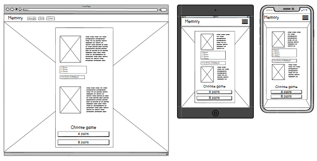
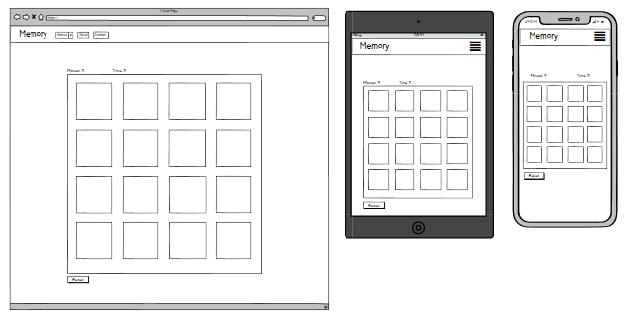
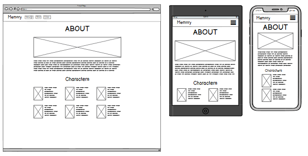
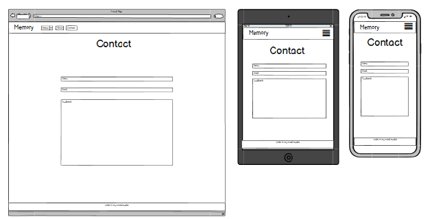

<h1 align="center">MEMORY GAME</h1>

[View the live project here.]()


## User Experience (UX)


- ### User stories

    The selected audience for this Memory Game are kids and adults. tough DISCO ELYSIUM has a targeted audience by the age of +18, this Memory Game dosn't fullfill any of that criteria. 

    - As a First Time Visitor,

        1. I want to get clear instructions on how the site works, what you can do, and how to do it.
        2. I want to easily navigate my way through the website. 

    - As as user,
    
        1. I want the game to be played easily.
        2. I want feedback once the game is done, such as how long it took and how many moves was made to finish the game. 
        3. I want to reset the game when the game is finished or to have another game option presented, to add more cards to the game or to add less cards. 
        4. I want to know more about the real game, where I can see a trailer, where to purchase it etc. 
        5. Get in touch with the developer of this Memory Game, to give feedback on the project. 

### Strategy 
- This Project is meant to be an hommage to the RPG game DISCO ELYSIUM made by [ZA/UM](https://discoelysium.com/), were you play as the detective Harrier Du Bois, wich unfortunately has lost his memory. So by playing DISCO ELYSIUM, and by planing this project. I thought it was a great idea to do a easily to play and interesting memory game. 
- I have selfish reasons for doing this project, it's as simply as to get a better understanding of javaScript. To learn more of it along the way, and by the end, to have more expreience using javaScript.  

### Scope
- I wanted to make an easily and understandable Memory Game, wich would be fun to play, and test your memory skills as well. Adding some features such as an interactive menu, just to make it more interesting. 
- I want to implement audio wich you will be able to turn on and off, and adjust the volume. 

    - ### Menu 
        1. When you enter the site, there will be a interactive menu, the menu will ask you a question, and you will have dialog choices to make, your choice will be displayed, and a new dialog will apear, wich urges you to choose among the two diffrent game choices, a 4  pair or a 8 pair Memory Game.

    - ### Game Area 
        1. There will be the gameboard, holding the amount of cards that you choosed to play with.
        2. After your first move, a timer and a move counter will start. 
        3. Just below the gameboard there will be a reset button, wich will as you can imaging, reset the game.
        4. When the game is finished, a modal appears with your time and the amount of moves it took and a Congratualtions messeage for completing the game. A Choice to try again, mabye to invite you to do it quicker or by using lesser moves. Or the option to choose between the game choices.

    - ### About
        1. Here you will find some information about the game DISCO ELYSIUM.
        2. Info of some of the most interesting characters within the game.
        3. Links to [ZA/UM](https://discoelysium.com/)'s diffrent platforms. 

    - ### Contact
        1. Here you will be able to send feedback to the developer.
        2. Get access to the developers diffrent platforms. 

### Structure
- The website will include four diffrent pages, Home, Game, About & Contact.
- All pages will have a navigation bar at the top, with link for easy navigation throught out the diffrent pages of the website. 
    The Game link in the navbar will have a dropdown menu, to reavel the two diffrent choices of memory. 
    When displayed on smaller devices such as an tablett or mobile, the navigation links will collapse into a toggler menu. 


- ### Skeleton 
    -    
    
- ### Surface
    -

-   ### Design

-   ### Wireframes






- Home Page Wireframe - [view]()
- Game Page Wireframe - [view]()
- About Page Wireframe - [view]()
- Contact Page Wireframe - [view]()

## Features


## Technologies Used

### Languages Used

-   [HTML5](https://en.wikipedia.org/wiki/HTML5)
-   [CSS3](https://en.wikipedia.org/wiki/Cascading_Style_Sheets)

### Frameworks, Libraries & Programs Used

- [jQuery](https://jquery.com/)
- [Bootstrap v5.0](https://getbootstrap.com/docs/5.0/getting-started/introduction/)
- [Hover.css](https://ianlunn.github.io/Hover/) - Hover effect on buttons.
- [fontAwesome](https://fontawesome.com/) - provides icons across the site. 

## Testing


### Testing User Stories from User Experience (UX) Section


### Further Testing


### Known Bugs


## Deployment

### GitHub Pages

The project was deployed to GitHub Pages using the following steps...

1. Log in to GitHub and locate the [GitHub Repository](https://github.com/)
2. At the top of the Repository (not top of page), locate the "Settings" Button on the menu.
    - Alternatively Click [Here](https://raw.githubusercontent.com/) for a GIF demonstrating the process starting from Step 2.
3. Scroll down the Settings page until you locate the "GitHub Pages" Section.
4. Under "Source", click the dropdown called "None" and select "Master Branch".
5. The page will automatically refresh.
6. Scroll back down through the page to locate the now published site [link](https://github.com) in the "GitHub Pages" section.

### Forking the GitHub Repository

By forking the GitHub Repository we make a copy of the original repository on our GitHub account to view and/or make changes without affecting the original repository by using the following steps...

1. Log in to GitHub and locate the [GitHub Repository](https://github.com/)
2. At the top of the Repository (not top of page) just above the "Settings" Button on the menu, locate the "Fork" Button.
3. You should now have a copy of the original repository in your GitHub account.

### Making a Local Clone

1. Log in to GitHub and locate the [GitHub Repository](https://github.com/)
2. Under the repository name, click "Clone or download".
3. To clone the repository using HTTPS, under "Clone with HTTPS", copy the link.
4. Open Git Bash
5. Change the current working directory to the location where you want the cloned directory to be made.
6. Type `git clone`, and then paste the URL you copied in Step 3.

```
$ git clone https://github.com/YOUR-USERNAME/YOUR-REPOSITORY
```

7. Press Enter. Your local clone will be created.

```
$ git clone https://github.com/YOUR-USERNAME/YOUR-REPOSITORY
> Cloning into `CI-Clone`...
> remote: Counting objects: 10, done.
> remote: Compressing objects: 100% (8/8), done.
> remove: Total 10 (delta 1), reused 10 (delta 1)
> Unpacking objects: 100% (10/10), done.
```

Click [Here](https://help.github.com/en/github/creating-cloning-and-archiving-repositories/cloning-a-repository#cloning-a-repository-to-github-desktop) to retrieve pictures for some of the buttons and more detailed explanations of the above process.

## Credits

### Code


### Content


### Media

- [Background](https://nordic.ign.com/disco-elysium/30263/review/disco-elysium-review) image is from IGN Nordic, the image was illustrated by [ZA/UM Studio](https://discoelysium.com/).

- The game cards was obtained from [Disco Elysium Wiki](https://disco-elysium-archive.fandom.com/wiki/Disco_Elysium_Wiki).

### Acknowledgements

- The layout inspration for this README.md is from Code Institute's own [Sample README](https://github.com/Code-Institute-Solutions/SampleREADME).